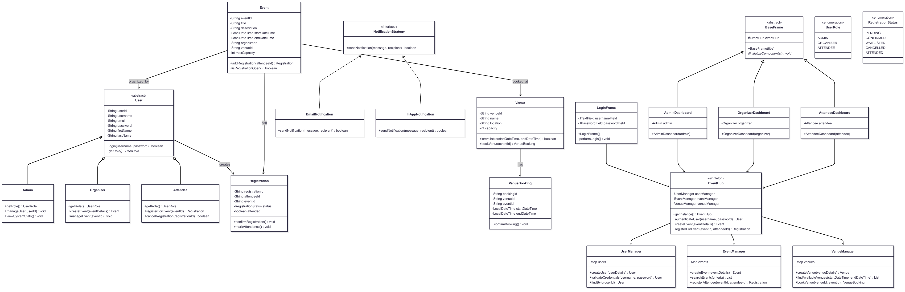

Proposal:
# Campus EventHub  
**OOP Final Project Proposal**

---

## Project Overview  
Campus EventHub is a comprehensive event management system designed for university environments. The system facilitates coordination between event organizers, attendees, and administrators through a role-based interface that manages the event lifecycle from creation to post-event analytics.

---

## Description  
Campus EventHub will be implemented as a Java desktop app with a GUI featuring role-based authentication and distinct interfaces for each user type. The system will handle events such as event creation, registration management, venue booking, and generating reports.

---

## Functionality

### 1. User Management & Authentication
- **Role-based login system** (Organizer, Attendee, Admin)  
- **User registration** with email verification simulation  
- **Profile management** with contact details and preferences  
- **Account status management** (active/suspended/pending approval)

### 2. Event Management (Organizer)
- **Create events** with comprehensive details:
  - Event type (Workshop, Seminar, Club Meeting, Guest Lecture, Social Event)
  - Date, time, duration, and venue requirements
  - Capacity limits and registration deadlines
  - Event description, prerequisites, and target audience
- **Manage event lifecycle**: `Draft → Published → Active → Completed → Archived`  
- **Monitor registrations** with waitlist management  
- **Send notifications** to registered attendees  
- **Cancel or reschedule events** with automatic attendee notification

### 3. Attendee
- Browse events with advanced filtering (date, type, department, availability)
- Event registration with confirmation and calendar integration
- Manage registrations with conflict detection
- Registration history and attendance tracking
- Wishlist functionality for interesting events
- Receive notifications for event updates and reminders

### 4. Administrative Controls (Admin)
- Venue management: Add/remove venues with capacity and equipment details  
- User approval workflow for new organizers  
- Event oversight: Approve, reject, or request modifications to proposed events  
- System monitoring: Track user activity and system usage  
- Generate comprehensive reports and analytics

### 5. Advanced Implementations
- Smart conflict detection and venue double-booking prevention
- Capacity management: Automatic waitlist handling and overflow notifications
- Event categorization: Department-wise and interest-based grouping
- Attendance tracking: QR code generation for check-ins (simulated)

---

## System Architecture

### Classes & Hierarchy
- `User` (Abstract base class)
  - `Organizer`: Event creation and management capabilities
  - `Attendee`: Registration and wishlist management
  - `Admin`: System oversight and administrative functions
- `Event`: Comprehensive event data and lifecycle management
- `Venue`: Physical location details and availability tracking
- `Registration`: Attendee-event relationship with status tracking
- `EventHub`: Central system coordinator (**Singleton pattern**)
- `Notification`: Message system for user communications
- `Report`: Abstract base for various analytics reports

---

## Design Implementation
- **Singleton Pattern**: `EventHub` system instance and configuration manager  
- **Observer Pattern**: Real-time GUI updates and notification system  
- **Factory Pattern**: Create different event types and report formats  
- **State Pattern**: Event lifecycle management (`Draft → Published → Active → Completed`)  
- **Strategy Pattern**: Different notification delivery methods and report generation strategies  
- **Command Pattern**: User actions with undo/redo functionality  

---

## User Interface Ideas

### Organizer Dashboard
- My Events: Event creation wizard and management panel
- Analytics: Event performance metrics and attendee insights
- Calendar view with venue availability

### Attendee Portal
- Event Browser: Advanced search and filtering capabilities
- My Registrations: Registration history
- Recommendations: Suggested events based on interests

### Admin Console
- System Overview: Key metrics  
- User Management: Approval workflows and account administration  
- Reports: Comprehensive analytics and usage statistics  

---

## Specifications
- **Language**: Java 11+ with modern language features  
- **GUI Framework**: Java Swing with custom components and layouts  
- **Data Persistence**: Serialized object files with backup/restore functionality  
- **Architecture**: Layered architecture with clear separation of concerns  
- **Validation**: Comprehensive input validation and business rule enforcement  
- **Logging**: Event logging for audit trails and debugging  

---

## Deliverables

### 1. Functional
- Support all three user roles with appropriate permissions  
- Process complete event lifecycle from creation to completion  
- Generate accurate reports reflecting current system state  

### 2. Documentation
- Complete UML diagram suite (Use Cases, Classes, Sequences)  
- User manual and technical documentation  
- Test cases and scenarios  

---

## Class Diagram:

## Usecase Diagram:

## Sequence Diagram:

